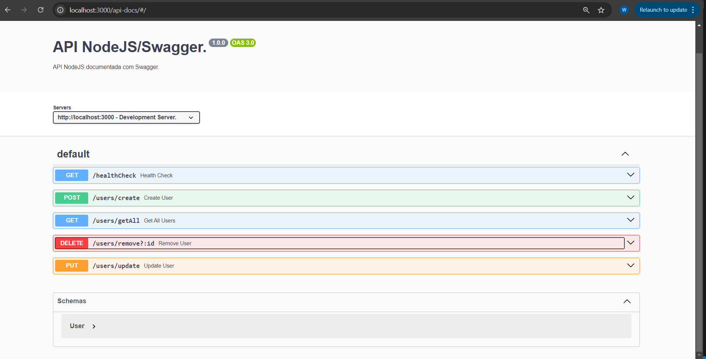

# API NodeJS Documentada com Swagger
Esta é uma API desenvolvida em NodeJS como um exemplo para documentação com Swagger. Vamos abordar como criar a API, documenta-la e acessar sua documentação.
Como esta é uma aplicação de exemplo eu criei um **"Store"** em memória apenas para utilizarmos como base de dados e fazer operações básicas de CRUD.

### Inicie sua aplicação
Abra o seu terminal na pasta desejada e inicie uma aplicação NodeJS:
```shell
npm init -y
```

Instale as dependências necessárias para criar a API e documenta-la:
```shell
npm install express cors helmet dotenv swagger-jsdoc swagger-ui-express
```
Instale as dependências de desenvolvimento:
```shell
npm install -D @types/express @types/cors @types/node @types/swagger-jsdoc @types/swagger-ui-express nodemon ts-node typescript
```

Configure os scripts do seu **package.json**:
```json
 "scripts": {
    "build": "tsc",
    "start": "node dist/server.js",
    "dev": "nodemon src/server.ts",
    "test": "echo \"Error: no test specified\" && exit 1"
  },
```

### Configuração Swagger
No meu caso eu criai uma classe para abstrair a configuração do arquivo main da aplicação:

```ts
export class SwaggerConfig {
    config: {
        swaggerDefinition: {
            openapi: string;
            info : {
                title: string;
                version: string;
                description: string;
            };
            servers: [{
                url: string;
                description: string;
            }];
        };
        apis: string[];
    }

    constructor() {
        const port = parseInt(`${process.env.PORT || 3000}`);

        this.config = {
            swaggerDefinition: {
                // versao do swagger
                openapi: "3.0.0",
                info: {
                    // node da aplicação
                    title: "API NodeJS/Swagger.",
                    // versão da documentação
                    version: "1.0.0",
                    // descrição da api
                    description: "API NodeJS documentada com Swagger."
                },
                // seus servidores
                servers: [{
                    // endereço do seu servidor back-end
                    url: `http://localhost:${port}`,
                    // descrição do seu servidor back-end
                    description: "Development Server."
                }],
            },
            // caminho dos arquivos onde a documentação de cada endpoint será persistida
            // no meu caso tenho documentação tanto nas minhas routes como nas controllers
            apis: ["./src/routes/**/*.ts", './src/controllers/**/*.ts'],
        };
    }
}
```

### Configuração Server
```ts
import dotenv from "dotenv";
import express from "express";
import cors from "cors";
import helmet from "helmet";import swaggerJsdoc from "swagger-jsdoc";
import swaggerUi from "swagger-ui-express";
import { SwaggerConfig } from "./infra/swagger/Swagger";
import router from "./routes";
import { Store } from "./infra/store/Store";

dotenv.config();

const app = express();

app.use(cors());

app.use(helmet());

app.use(express.json())

app.use(router);

const swagger = new SwaggerConfig();

const port = parseInt(`${process.env.PORT || 3000}`);

app.use("/api-docs", swaggerUi.serve, swaggerUi.setup(swaggerJsdoc(swagger.config)));

const UserStore = new Store()

app.listen(port, () => console.log(`Server Running on PORT: ${port}.`));

export default UserStore;
```

Assim, você tem sua aplicação preparada para trabalhar com o Swagger, basta adicionar a documentação de seus endpoints, é recomendado que as deixe nas controllers para manter uma organização clara sobre cada endpoint.

<details>
    <summary>Store</summary>

O Store é uma classe que trabalha com dados genéricos, onde os objetos devem ter sempre um **id**.
E temos operações  para inserir dados na store, atualizar, buscar e remover.
```ts
import { IStore } from "./IStore";

export class StoreData {
    id?: number;
}

export class Store<T extends StoreData> implements IStore<T> {
    private instance: T[];

    constructor() {
        this.instance = [];
    }

    get(): T[] {
        return this.instance;
    }

    add(value: T): T[] {
        value.id = this.instance.length + 1;

        this.instance.push(value);
        
        return this.instance.sort();
    }

    update(value: T): T[] {
        for(let i = 0; i < this.instance.length; i++) {
            if(this.instance[i].id === value.id) {
                this.instance[i] = value;
            }
        }

        return this.instance.sort();
    }

    remove(id: number): T[] {
        this.instance = this.instance.filter((v) => v.id !== id);

        return this.instance.sort();
    }
}
```
</details>

<details>
    <summary>Users</summary>

Nessa api teremos operações onde será possível manipular dados de usuários.
```ts
import { StoreData } from "../infra/store/Store";

export class User extends StoreData {
    name: string;
};
```
</details>

### Endpoints e suas Documentações
Nesta aplicação vamso ter endpoints para manipulação de dados de usuários, então teremos operações de criação, leitura, atualização e remoção, aqui veremos como documentar tais endpoints, passando seu endereço, descrição, método, parâmetros e respostas.

<details>
    <summary>Create</summary>

```ts
/**
 * @swagger
 * 
 * /users/create:
 *   post:
 *     summary: Create User
 *     description: Criação de um usuário, no qual você deve enviar o `name` no body.
 *     requestBody:
 *       required: true
 *       content:
 *         application/json:
 *           schema:
 *             $ref: '#/components/schemas/User'
 *           example:
 *             name: "Sherlock Holmes"
 * 
 *     responses:
 *       200:
 *         description: Success
 *         content:
 *           application/json:
 *             schema:
 *               type: array
 *               items:
 *                 $ref: '#/components/schemas/User'
 *             example:
 *               - id: 1
 *                 name: "Sherlock Holmes"
 *               - id: 2
 *                 name: "John Watson"
 *       500:
 *         description: Internal Server Error
 *         content:
 *           application/json:
 *             schema:
 *               type: object
 *               properties:
 *                 error:
 *                   type: string
 *                   description: Mensagem de erro
 *                   example: "Name is required!"
 */
export function CreateUser(req: Request, res: Response) {
    try {
        const user = req.body as User;

        if(!user.name) {
            throw new Error("Name is required!");
        }

        res.status(200).send(UserStore.add(user));
    } catch (err) {
        const error = {
            message: (err as Error).message,
        };

        res.status(500).send({ error });
    }
}
```
</details>

<details>
    <summary>Read</summary>

```ts
/**
 * @swagger
 * components:
 *   schemas:
 *     User:
 *       type: object
 *       properties:
 *         id:
 *           type: integer
 *           description: ID único do usuário
 *           example: 1
 *         name:
 *           type: string
 *           description: Nome do usuário
 *           example: "Sherlock Holmes"
 * 
 * /users/getAll:
 *   get:
 *     summary: Get All Users
 *     description: Retorna um array de objetos `User`, cada um contendo o `id` e o `name`.
 *     responses:
 *       200:
 *         description: Success
 *         content:
 *           application/json:
 *             schema:
 *               type: array
 *               items:
 *                 $ref: '#/components/schemas/User'
 *             example:
 *               - id: 1
 *                 name: "Sherlock Holmes"
 *               - id: 2
 *                 name: "John Watson"
 */
export function GetAllUsers(req: Request, res: Response) {
    try {
        res.status(200).send(UserStore.get());
    } catch (err) {
        const error = {
            message: (err as Error).message,
        };

        res.status(500).send({ error });
    }
}
```
</details>


<details>
    <summary>Update</summary>

```ts
/**
 * @swagger
 * 
 * /users/update:
 *   put:
 *     summary: Update User
 *     description: Atualização de um usuário, no qual você deve enviar o `name` que deseja atualizar e o `id` do usuário em questão no body.
 *     requestBody:
 *       required: true
 *       content:
 *         application/json:
 *           schema:
 *             $ref: '#/components/schemas/User'
 *           example:
 *             id: 1
 *             name: "Sherlock Holmes"
 * 
 *     responses:
 *       200:
 *         description: Success
 *         content:
 *           application/json:
 *             schema:
 *               type: array
 *               items:
 *                 $ref: '#/components/schemas/User'
 *             example:
 *               - id: 1
 *                 name: "Sherlock Holmes"
 *               - id: 2
 *                 name: "John Watson"
 *       500:
 *         description: Internal Server Error
 *         content:
 *           application/json:
 *             schema:
 *               type: object
 *               properties:
 *                 error:
 *                   type: string
 *                   description: Mensagem de erro
 *                   example: "Id and Name is required!"
 */
export function UpdateUser(req: Request, res: Response) {
    try {
        const user = req.body as User;

        if(!user.id || !user.name) {
            throw new Error("Id and Name is required!");
        }

        res.status(200).send(UserStore.update(user));
    } catch (err) {
        const error = {
            message: (err as Error).message,
        };

        res.status(500).send({ error });
    }
}
```
</details>

<details>
    <summary>Delete</summary>

```ts
/**
 * @swagger
 * 
 * /users/remove?:id:
 *   delete:
 *     summary: Remove User
 *     description: Remoção de um usuário, no qual você deve enviar o `id` do usuário em questão como parâmetro.
 *     parameters:
 *       - in: query
 *         name: id
 *         required: true
 *         schema:
 *           type: integer
 *         description: ID do usuário a ser removido
 *         example: 1
 * 
 *     responses:
 *       200:
 *         description: Success
 *         content:
 *           application/json:
 *             schema:
 *               type: array
 *               items:
 *                 $ref: '#/components/schemas/User'
 *             example:
 *               - id: 1
 *                 name: "Sherlock Holmes"
 *               - id: 2
 *                 name: "John Watson"
 *       500:
 *         description: Internal Server Error
 *         content:
 *           application/json:
 *             schema:
 *               type: object
 *               properties:
 *                 error:
 *                   type: string
 *                   description: Mensagem de erro
 *                   example: "Id is required!"
 */
export function RemoveUser(req: Request, res: Response) {
    try {
        const { id } = req.query;

        if(!id) {
            throw new Error("Id is required!");
        }

        res.status(200).send(UserStore.remove(parseInt(id as string)));
    } catch (err) {
        const error = {
            message: (err as Error).message,
        };

        res.status(500).send({ error });
    }
}
```
</details>

Para acessar o Swagger da aplicação basta executa-lá e acessar o endpoint **http://localhost:3000/api-docs/**.


